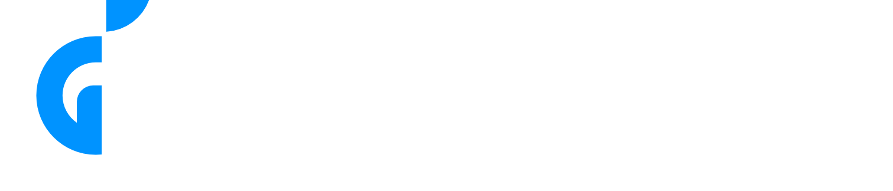
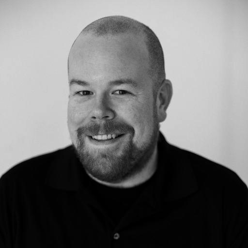
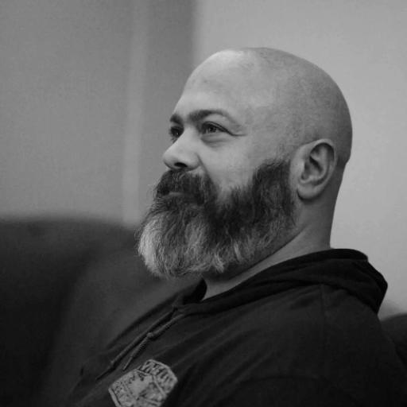

<video autoplay loop muted playsinline class="bg-video" poster="assets/videos/lander-background.jpg"><source src="/assets/videos/lander-background.mp4" type="video/mp4"></video>

    

        
    

    

        

            <h1 class="fst-italic lh-1 mb-4">Interested?</h1>
            <h4>We’re flattered!</h4>
            
<em role="heading">We aren’t presently raising money.</em> However, we always enjoy meeting accredited investors, whether you’re a venture capital firm, an angel, a family office, or a strategic investor. Please get in touch and let’s see where our vision for the future of multiplayer might fit in your portfolio.
             
           <a class="btn btn-brand investor-button" href="http://investor-onboarding.greathorn.games" aria-label="Investors Updates Signup">Investors Updates Signup</a>             
        

    

    

        
        
        
        
    

&copy; 2025 Greathorn Games Inc. All Rights Reserved.

